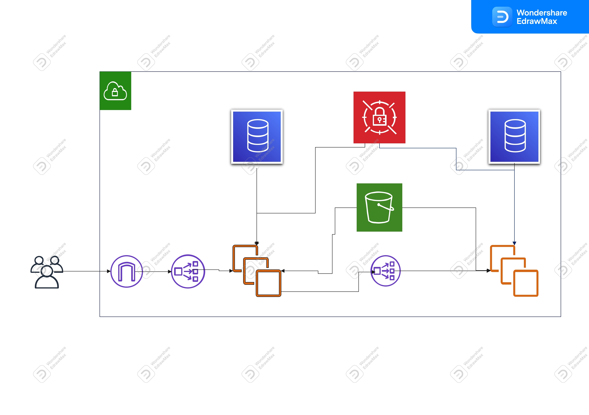

<!-- PROJECT LOGO -->
<br />
<div align="center">
  <a href="https://github.com/kinetichub/pcq2">
    
  </a>

<h3 align="center">PicCollage Take Home Project</h3>

  <p align="center">
    Sticker Search and Feedback System
  </p>
</div>


<!-- TABLE OF CONTENTS -->
<details>
  <summary>Table of Contents</summary>
  <ol>
    <li>
      <a href="#about-the-project">About The Project</a>
      <ul>
        <li><a href="#built-with">Built With</a></li>
        <li><a href="#design-choices">Design Choices</a></li>
        <li><a href="#design-choices-drawbacks">Design Choices Drawbacks</a></li>
      </ul>
    </li>
    <li>
      <a href="#getting-started">Getting Started</a>
      <ul>
        <li><a href="#prerequisites">Prerequisites</a></li>
        <li><a href="#installation">Installation</a></li>
      </ul>
    </li>
    <li><a href="#usage">Usage</a></li>
    <li><a href="#cloud-architecture">Cloud Architecture</a></li>
    <li><a href="#contact">Contact</a></li>
  </ol>
</details>


<!-- ABOUT THE PROJECT -->
## About The Project

This project is intended for internal review at PicCollage only as a project to evaluate a potential candidate.
The project is not production-ready as-is.

<p align="right">(<a href="#readme-top">back to top</a>)</p>


### Built With

* [![Django][Django]][Django-url]
* [![Docker][Docker]][Docker-url]
* [![Postgres][Postgres]][Postgres-url]

<p align="right">(<a href="#readme-top">back to top</a>)</p>

### Design Choices

* The Python-based [Django][Django-url] framework was chosen primarily because it is the framework I am most familiar with.
In addition, it includes a strong toolset (i.e. authentication and ORM) for completing the given task.

* The project is split into two services. The first service (SearchService) is for running the search algorithm and 
returning the results of the machine learning model. The second service (StickerService) is for providing a customer endpoint 
for sticker searching, customer feedback, and usage analysis by internal admins. The reasoning for this split is:

    * The primary motivation for this division is to separate any impact of development done on the machine learning model
    from the service provided to the customer. If we imagine that the Sticker service relies on many different ml-models, 
    for various calls and functions, then we increase the likelihood that at some point a change to one of the ml-models
    causes the primary sticker service to have an issue. By having the ml-models seperated into services,
    we reduce the blast radius of any one model from potentially impacting other services if something goes wrong (i.e. a 
    mega memory leak).
  
    * Separating ml-model from the primary service also reduces complexity in library requirements. It is easy to imagine
    a scenario where we have many ml-models all together, and the [dependency nightmare](https://en.wikipedia.org/wiki/Dependency_hell)
    that could be caused due to multiple ml-models depending on different versions of the same library.
  
    * Having the sticker endpoint as a proxy to the algorithm search means that we can very easily switch what algorithm is
    used with very little development cost. Although we could have built this proxy relationship into a single service, 
    this ensures the decoupling at a higher level.

<p align="right">(<a href="#readme-top">back to top</a>)</p>

### Design Choices Drawbacks

* Django is a powerful framework, however it does have more complexity and overhead than other lighter frameworks.

* Splitting the service into two services means that there will be **redundancy** in code, more overhead **cost** of supporting a 
second database and compute machine, as well as increased overall **complexity**.

<p align="right">(<a href="#readme-top">back to top</a>)</p>

<!-- GETTING STARTED -->
## Getting Started

The services in this project can be run directly using the [Django][Django-url] built-in development server. 
However, the recommended approach is to use [Docker][Docker-url] via the provided Compose file to quickly setup your 
environment for testing and development.

### Prerequisites

Other versions than the ones listed below may work, but this is what the project has been tested with.
Please follow the links below for instructions on installation.

* **Python >= 3.9.x**
  * [installation instructions](https://realpython.com/installing-python/)
* **Docker >= 20.x.x**
  * [installation instructions](https://docs.docker.com/desktop/)

### Installation

Everything to get the project up and running locally is included in the Docker Compose and associated Docker files.
Please note that the initial run will take some time, as it downloads necessary files and does image processing.
If you attempt to use an API and get a connection error, be sure that the service is up and running in the container.

1. Clone the repo
   ```sh
   git clone https://github.com/kinetichub/pcq2.git
   ```
2. Create an `.env` file from the `.env.example` file
   ```sh
   cp .env.example .env
   ```
3. Run the Docker compose file
   ```sh
   docker compose up
   ```

<p align="right">(<a href="#readme-top">back to top</a>)</p>


<!-- USAGE EXAMPLES -->
## Usage

Once the services are running, you can call the endpoints by hitting `http://localhost:8000/` endpoints.
Under the assets folder, I have included a [Postman](https://www.postman.com/api-platform/api-client/) JSON file. 

These Postman calls should also work out-of-the-box coupled with the default `.env` file provided. 
Note that if the token is changed in the `.env` file, then the token will need to be updated in the 
Authorization section of the statistics request as well.

* An API to search for a term (can be accessed by any user)
   ```sh
   http://localhost:8000/api/search/?query=cat+in+a+park
   ```
* An API to report one or more stickers (can be accessed by any user)
  ```sh
   http://localhost:8000/api/feedback/
   ```
  An example body might be:
  ```sh
   {
    "feedback": [
        {
            "query": "cat in a park",
            "positive": ["COCO_val2014_000000004212.jpg", "COCO_val2014_000000001675.jpg"],
            "negative": ["COCO_val2014_000000002154.jpg", "COCO_val2014_000000000400.jpg", "COCO_val2014_000000003711.jpg"]
        }
    ]
  }
   ```
* An API to download this feedback (can be accessed only by the ML team) 
(this requires an Authorization Token associated to an admin user)
   ```sh
   http://localhost:8000/api/analytics/?query=cat+in+a+park
   ``` 
* An API to count the number of times a digit appears from 1 to N
   ```sh
   http://localhost:8000/api/counter/?digit=7&n=1000
   ```
* An admin interface for database models from Django
   ```sh
   http://localhost:8000/admin/
   ```


<p align="right">(<a href="#readme-top">back to top</a>)</p>


<!-- ARCHITECTURE SAMPLE -->
## Cloud Architecture


With whatis currently built, a **_very simple starting architecture_** would look something like this,
where we have the following:
* Bucket: This is to store our model file, images, and any other staticfiles or media we want to keep around.
* Databases: Each service would have a database that only it has access to.
* Secret Manager: We would store production secrets in the secret manager and use them to populate the environment,
replacing our `.env` file setup we use locally.
* Load Balancers: Depending on traffic, a good initial setup should include load balancing, one for external 
customer calls to come into our StickerService, and an internal one for StickerService to talk to SearchService.
* Gateway: The gateway allows public traffic into our private network.
* Compute Instances: These are instances that are running our containers, and should be auto scalable depending
on the traffic load.

<p align="right">(<a href="#readme-top">back to top</a>)</p>

<!-- CONTACT -->
## Contact

K. Alnajar - kalnajar09@gmail.com

Project Link: [https://github.com/kinetichub/pcq2](https://github.com/kinetichub/pcq2)

<p align="right">(<a href="#readme-top">back to top</a>)</p>


<!-- MARKDOWN LINKS & IMAGES -->
<!-- https://www.markdownguide.org/basic-syntax/#reference-style-links -->
[Django]: https://img.shields.io/badge/Django-092E20?style=for-the-badge&logo=django&logoColor=white
[Django-url]: https://www.djangoproject.com/
[Docker]: https://img.shields.io/badge/docker-%230db7ed.svg?style=for-the-badge&logo=docker&logoColor=white
[Docker-url]: https://www.docker.com/
[SQLite]: https://img.shields.io/badge/sqlite-%2307405e.svg?style=for-the-badge&logo=sqlite&logoColor=white
[SQLite-url]: https://www.sqlite.org/index.html
[Postgres]: https://img.shields.io/badge/postgres-%23316192.svg?style=for-the-badge&logo=postgresql&logoColor=white
[Postgres-url]: https://www.postgresql.org/