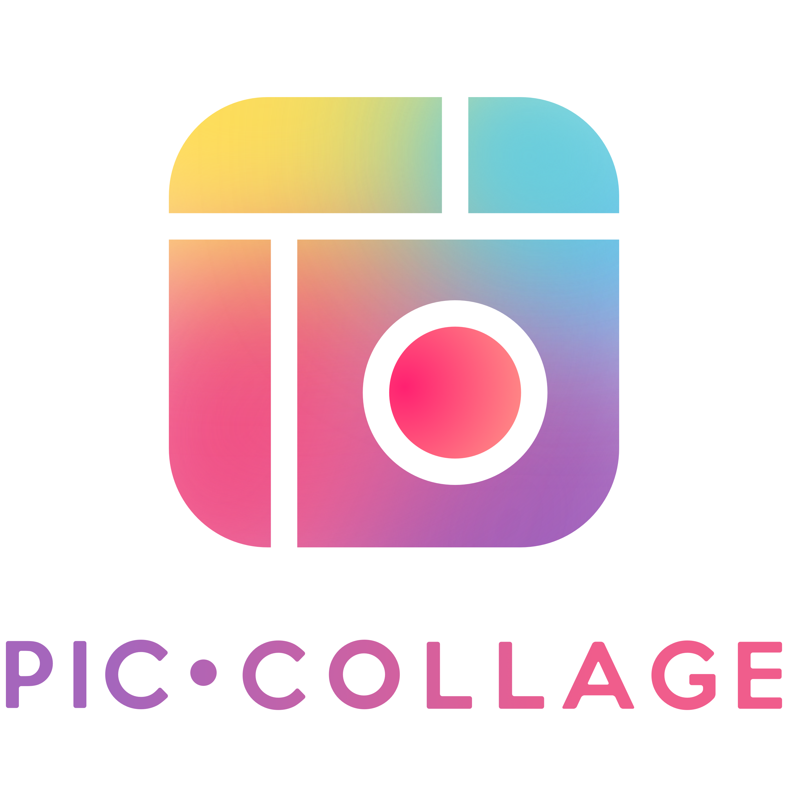

<!-- PROJECT LOGO -->
<br />
<div align="center">
  <a href="https://github.com/kinetichub/repo_name">
    
  </a>

<h3 align="center">PicCollage Take Home Project</h3>

  <p align="center">
    Sticker Search and Feedback System
    <br />
    <a href="https://github.com/kinetichub/repo_name"><strong>Explore the docs »</strong></a>
    <br />
    <br />
    <a href="https://github.com/kinetichub/repo_name">View Demo</a>
    ·
    <a href="https://github.com/kinetichub/repo_name/issues">Report Bug</a>
    ·
    <a href="https://github.com/kinetichub/repo_name/issues">Request Feature</a>
  </p>
</div>


<!-- TABLE OF CONTENTS -->
<details>
  <summary>Table of Contents</summary>
  <ol>
    <li>
      <a href="#about-the-project">About The Project</a>
      <ul>
        <li><a href="#built-with">Built With</a></li>
      </ul>
    </li>
    <li>
      <a href="#getting-started">Getting Started</a>
      <ul>
        <li><a href="#prerequisites">Prerequisites</a></li>
        <li><a href="#installation">Installation</a></li>
      </ul>
    </li>
    <li><a href="#usage">Usage</a></li>
    <li><a href="#roadmap">Roadmap</a></li>
    <li><a href="#contributing">Contributing</a></li>
    <li><a href="#license">License</a></li>
    <li><a href="#contact">Contact</a></li>
    <li><a href="#acknowledgments">Acknowledgments</a></li>
  </ol>
</details>


<!-- ABOUT THE PROJECT -->
## About The Project

[![Product Name Screen Shot][product-screenshot]](https://example.com)

This project is intended for internal review at PicCollage only as a project to evaluate a potential candidate.
The project is not production-ready as-is.

Here's a blank template to get started: To avoid retyping too much info. Do a search and replace with your text editor for the following: `kinetichub`, `repo_name`, `twitter_handle`, `linkedin_username`, `email_client`, `email`, `project_title`, `project_description`

<p align="right">(<a href="#readme-top">back to top</a>)</p>


### Built With

* [![Django][Django]][Django-url]
* [![Docker][Docker]][Docker-url]
* [![SQLite][SQLite]][SQLite-url]

<p align="right">(<a href="#readme-top">back to top</a>)</p>

### Design Choices

* The Python-based [Django][Django-url] framework was chosen primarily because it is the framework I am most familiar with.
In addition, it includes a strong toolset (i.e. authentication and ORM) for completing the given task.

* SQLite is used as the database engine for simplicity of setting up the demo project, and avoids the need to create
a database with actual monetary costs. In addition, a real database would need to have the passwords stored in a 
proper secrets manager, which is outside the scope of this project.

* The project is split into two services. The first service (SearchService) is for running the search algorithm and 
returning the results of the machine learning model. The second service (StickerService) is for providing a customer endpoint 
for sticker searching, customer feedback, and usage analysis by internal admins. The reasoning for this split is:

    * The primary motivation for this division is to separate any impact of development done on the machine learning model
    from the service provided to the customer. If we imagine that the Sticker service relies on many different ml-models, 
    for various calls and functions, then we increase the likelihood that at some point a change to one of the ml-models
    causes the primary sticker service to have an issue. By having the ml-models seperated into services,
    we reduce the blast radius of any one model from potentially impacting other services if something goes wrong (i.e. a 
    mega memory leak).
  
    * Separating ml-model from the primary service also reduces complexity in library requirements. It is easy to imagine
    a scenario where we have many ml-models all together, and the [dependency nightmare](https://en.wikipedia.org/wiki/Dependency_hell)
    that could be caused due to multiple ml-models depending on different versions of the same library.
  
    * Having the sticker endpoint as a proxy to the algorithm search means that we can very easily switch what algorithm is
    used with very little development cost. Although we could have built this proxy relationship into a single service, 
    this ensures the decoupling at a higher level.


<p align="right">(<a href="#readme-top">back to top</a>)</p>


<!-- GETTING STARTED -->
## Getting Started

The services in this project can be run directly using the [Django][Django-url] built-in development server. 
However, the recommended approach is to use [Docker][Docker-url] via the provided Compose file to quickly setup your 
environment for testing and development.

### Prerequisites

Other versions than the ones listed below may work, but this is what the project has been tested with.
Please follow the links below for instructions on installation.

* **Python >= 3.9.x**
  * [installation instructions](https://realpython.com/installing-python/)
* **Docker >= 20.x.x**
  * [installation instructions](https://docs.docker.com/desktop/)

### Installation

Everything to get the project up and running locally is included in the Docker Compose and associated Docker files.

1. Get a free API Key at [https://example.com](https://example.com)
2. Clone the repo
   ```sh
   git clone https://github.com/kinetichub/repo_name.git
   ```
3. Install NPM packages
   ```sh
   npm install
   ```
4. Enter your API in `config.js`
   ```js
   const API_KEY = 'ENTER YOUR API';
   ```

<p align="right">(<a href="#readme-top">back to top</a>)</p>


<!-- USAGE EXAMPLES -->
## Usage

Use this space to show useful examples of how a project can be used. Additional screenshots, code examples and demos work well in this space. You may also link to more resources.

_For more examples, please refer to the [Documentation](https://example.com)_

<p align="right">(<a href="#readme-top">back to top</a>)</p>


<!-- ROADMAP -->
## Roadmap

- [ ] Feature 1
- [ ] Feature 2
- [ ] Feature 3
    - [ ] Nested Feature

See the [open issues](https://github.com/kinetichub/repo_name/issues) for a full list of proposed features (and known issues).

<p align="right">(<a href="#readme-top">back to top</a>)</p>


<!-- LICENSE -->
## License

Distributed under the MIT License. See `LICENSE.txt` for more information.

<p align="right">(<a href="#readme-top">back to top</a>)</p>


<!-- CONTACT -->
## Contact

Your Name - [@twitter_handle](https://twitter.com/twitter_handle) - email@email_client.com

Project Link: [https://github.com/kinetichub/repo_name](https://github.com/kinetichub/repo_name)

<p align="right">(<a href="#readme-top">back to top</a>)</p>


<!-- MARKDOWN LINKS & IMAGES -->
<!-- https://www.markdownguide.org/basic-syntax/#reference-style-links -->
[contributors-shield]: https://img.shields.io/github/contributors/kinetichub/repo_name.svg?style=for-the-badge
[contributors-url]: https://github.com/kinetichub/repo_name/graphs/contributors
[forks-shield]: https://img.shields.io/github/forks/kinetichub/repo_name.svg?style=for-the-badge
[forks-url]: https://github.com/kinetichub/repo_name/network/members
[stars-shield]: https://img.shields.io/github/stars/kinetichub/repo_name.svg?style=for-the-badge
[stars-url]: https://github.com/kinetichub/repo_name/stargazers
[issues-shield]: https://img.shields.io/github/issues/kinetichub/repo_name.svg?style=for-the-badge
[issues-url]: https://github.com/kinetichub/repo_name/issues
[license-shield]: https://img.shields.io/github/license/kinetichub/repo_name.svg?style=for-the-badge
[license-url]: https://github.com/kinetichub/repo_name/blob/master/LICENSE.txt
[linkedin-shield]: https://img.shields.io/badge/-LinkedIn-black.svg?style=for-the-badge&logo=linkedin&colorB=555
[linkedin-url]: https://linkedin.com/in/linkedin_username
[product-screenshot]: images/screenshot.png
[Django]: https://img.shields.io/badge/Django-092E20?style=for-the-badge&logo=django&logoColor=white
[Django-url]: https://www.djangoproject.com/
[Docker]: https://img.shields.io/badge/docker-%230db7ed.svg?style=for-the-badge&logo=docker&logoColor=white
[Docker-url]: https://www.docker.com/
[SQLite]: https://img.shields.io/badge/sqlite-%2307405e.svg?style=for-the-badge&logo=sqlite&logoColor=white
[SQLite-url]: https://www.sqlite.org/index.html